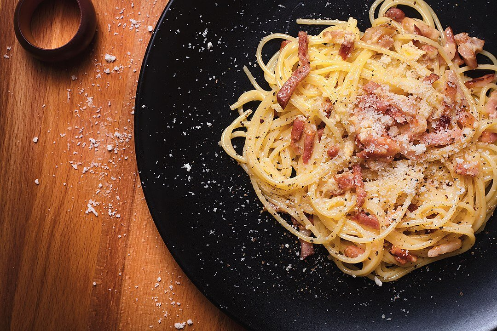

---
date:
  created: 2024-09-24
tags:
  - pasta
  - pancetta
  - cheese
  - egg
time:
  prep: 15 minutes
  cook: 15 minutes
---

# Authentic Carbonara
Delightfully simple and delicious, this creamy pasta recipe will make you think you are in Rome.
<!-- more -->

## Ingredients
- 300g pasta (Bucatini, Spaghetti, Rigatoni)
- 120g guanciale, sliced
- 30g pecorino romano, grated
- 20g grana padano, grated
- 2 large eggs, yolks only
- salt
- pepper

??? note

    - If you can't find guanciale, you can use pancetta, or another fatty cured cut
    - If you can't find grana padano or precorino, substitute with similar hard cheese to total 50g

## Method
1. Mix the egg yolks with the grated cheese until creamy. Add a pinch of salt and pepper, and set aside.
2. Cook the guanciale in a frying pan on low heat without added fat. You want to sweat the fat out of the strips and for them to become crunchy but not burnt! When the strips are crunchy and browned, remove and put to the side, keeping the fat for later.
3. At the same time, you can put the pasta on to boil. The pasta and the guanciale should take the same time (around 7~8 minutes).  You want the pasta with a bite "al dente" (slightly undercooked).
4. Take a cup of pasta water and put aside, then drain the pasta.  On a low heat add the pasta to the fat from the meat and the crunchy pieces of bacon together, mix well. Each piece of pasta should be coated with the fat. Take off the heat.
5. Ensure the pan is not too hot and add the egg and cheese mixture to the pasta; mixing well and quickly. Add pasta water as needed to give more moisture to the egg mixture. This starchy water makes more of a sauce and gives it that creamy finish.
6. A pinch of black pepper and your Carbonara is ready to serve. Top with more grated cheese as desired.
