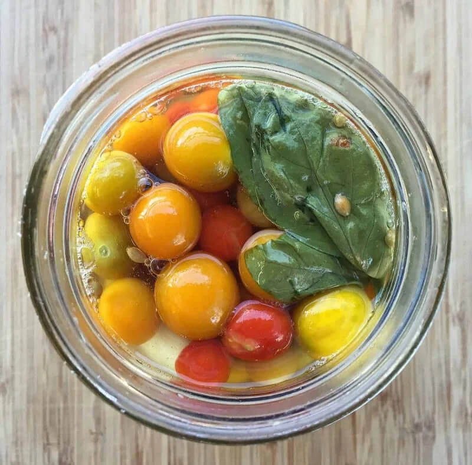

---
date:
  created: 2024-10-02
tags:
  - cherry tomatoes
  - fermented
time:
  prep: 10 minutes
---

# Fermented Cherry Tomatoes
An excellent way to preserve an abundance of cherry tomatoes.
The finished fermented tomatoes have a slight effervescence and amazing flavour!
<!-- more -->

## Ingredients
- 630 g under ripe cherry tomatoes
- 1 sprig fresh parsley
- 2 stems fresh basil
- 4 cloves garlic peeled
- 1/4 tsp black peppercorns
- 1/4 tsp coriander seeds
- 1/4 tsp mustard seeds
- 1 L water
- 3 tbsp salt

??? warning

    - Do not use chlorinated water! This will inhibit, or even prevent the fermentation.
    - Do not use iodised salt! This will inhibit, or even prevent the fermentation.

??? tip

    To de-chlorinate water, leave it in an unsealed container for 24h. The chlorine should evaporate.
    You can also boil it for 15 min to acheive the same result.

## Method
1. Put the peppercorns, coriander seeds, and mustard seeds into the bottom of a litre sized jar, 
     then layer in the tomatoes, parsley, basil, and garlic.
2. Mix together the water and salt to make a brine, and pour over the tomatoes, making sure to cover them completely. 
3. Use a weight to keep the tomatoes under the brine, and cover the jar with a towel. 
4. Put in a cool and dark corner to ferment for 6-8 days. 
5. Taste them along the way.
     When the tomatoes are finished fermenting they will burst with a champagne like effervescence in your mouth. 
6. Cover with a lid and store in the fridge. They are best after 1 to 2 weeks.

!!! note

    - These fermented cherry tomatoes will continue to gain effervescence even under refrigeration.
        The pressure is not in the jar, but in the tomatoes themselves!
    - Refrigerate for up to 6 months.
