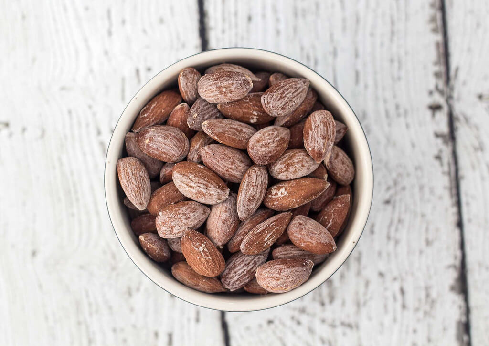

---
date:
  created: 2024-08-28
tags:
  - almonds
  - snack
time:
  prep: 10 minutes
  cook: 20 minutes
---

# Salted Almonds
Super simple and easy recipe for salted almonds. They are a perfect snack for parties, when having guests over,
or as a healthy snack at the office.
<!-- more -->

## Ingredients
- 200g almonds
- 4tbsp salt
- 200ml boiling water

## Method
1. Boil water and dissolve salt in it. Turn off the heat.
2. Pour the almonds into the water and let them soak for about 20 minutes.
3. Drain the water from the almonds. Place the almonds in an even layer on an oven tray/pan lined with baking paper.
4. Sprinkle the almonds with some extra salt and bake them at 150 C for about 20 minutes.
