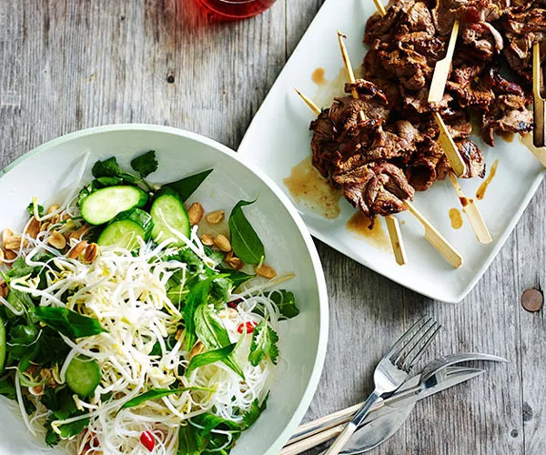

---
date:
  created: 2026-02-01
tags:
  - beef
  - salad
  - vermicelli
  - noodles
  - herbs
  - peanuts
time:
  prep: 20 minutes
  cook: 15 minutes
---

# Vietnamese Style Beef and Vermicelli Salad

A fast and fresh take on this Vietnamese classic.

<!-- more -->

## Ingredients

### Salad

- 250 gm vermicelli
- 45 gm roasted peanuts
- ½ small white onion, thinly sliced
- 2 Lebanese cucumbers, thinly sliced
- 2 cups each Vietnamese mint and coriander
- 100 gm bean sprouts

??? note

    Other vegetables and greens, such as carrots, daikon and spring onion, can be added as desired.

### Marinated Beef

- 500 gm beef tenderloin, thinly sliced
- 2 tbsp soy sauce
- 2 tbsp fish sauce
- 2 tsp sesame oil
- 2 tsp honey

### Nuoc Cham

- 60 ml white vinegar
- 55 gm caster sugar
- Juice of 2 limes
- 2 tbsp fish sauce
- 3 small red chillies, finely chopped
- 1 garlic clove, crushed

??? note

    nɨək̚˧˦ t͡ɕəm˧˦ (nook chum)

## Method

1. For marinated beef, combine ingredients in a bowl.
2. Soak vermicelli in boiling water for 5 minutes, then drain, rinse under cold running water, drain again and set aside in a bowl.
3. Meanwhile for nuoc cham, combine ingredients in a bowl and season to taste.
4. Thread beef onto skewers and chargrill, turning once, until charred and just cooked (30 seconds to 1 minute each side).
5. Toss vermicelli and remaining ingredients in a bowl, add dressing, toss to combine, top with bean sprouts and serve with beef.

??? tip "Tip: without skewers"

    To cook without skewers, fry the beef in batches on the stove, removing when the juices begin to run. Once all the beef has been cooked, add any remaining marinade to the pan and reduce until thick and syrupy. Briefly re-add the beef, and stir until fully coated.
